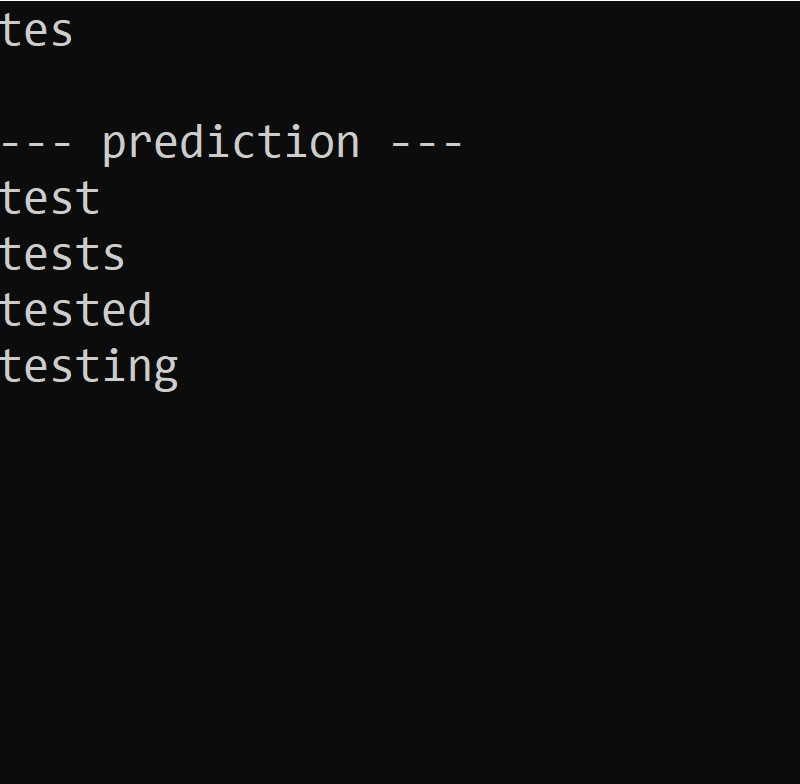
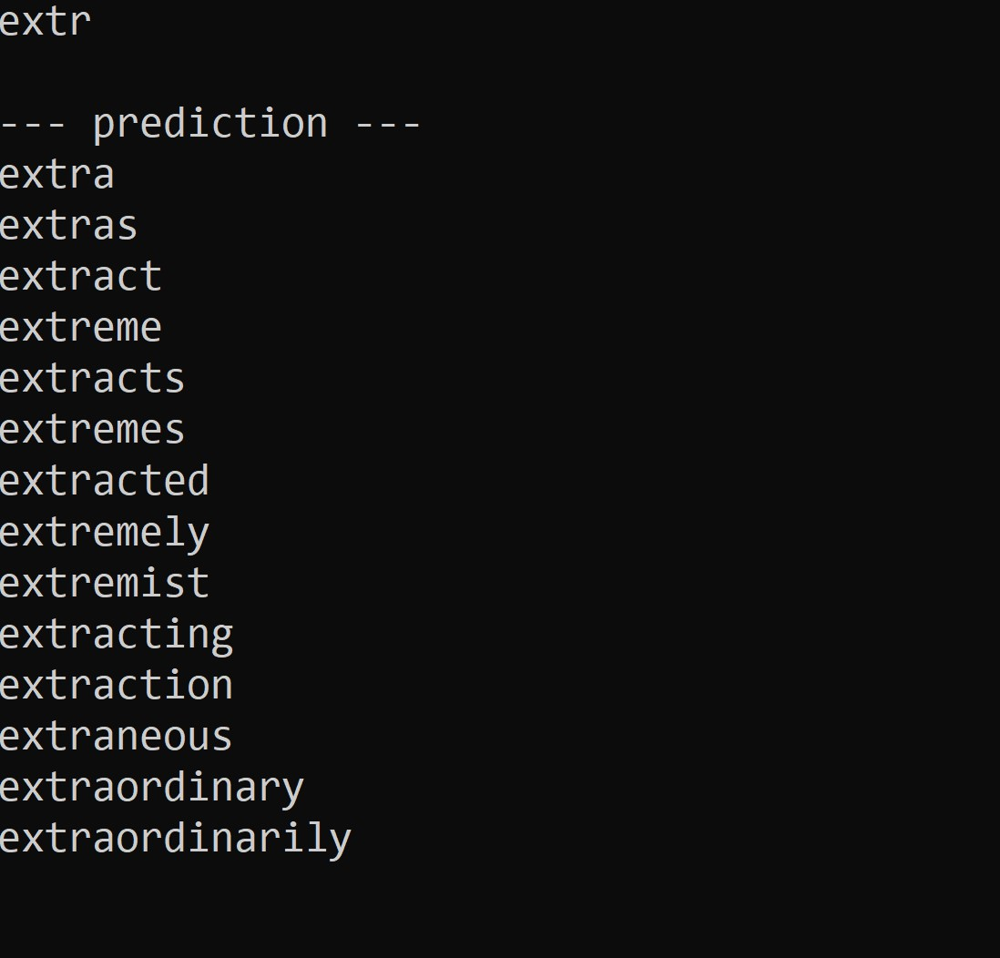

## Description

This program allows the user to begin typing a word and see a list of predicted words they may be attempting to type.  The program begins by reading a list of words from a text file (dictionary.txt) and storing them into an n-ary tree.  Then, the user is presented with a blank screen, showing a cursor in the upper left.  The user can begin typing a word and seeing a list of predicted words.  After each key-press, the program uses the word tree to predict the next set of possible words they may be typing and displays them below the input line.  See the Sample View section below for an example of how this looks.

## View

